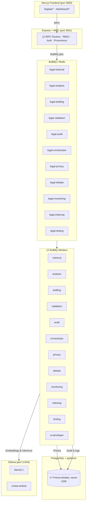

# 🤖 LAW MATE Agent Swarm

This document describes the multi‑agent system powering LAW MATE — a production‑ready legal AI platform for Malaysian law firms and legal departments. The agent swarm consists of 12 specialized BullMQ workers, a workflow orchestrator, and a human‑in‑the‑loop (HITL) governance layer.

---

## 🧠 Overview

The agent swarm is built on **BullMQ** with Redis as the message broker. Each worker runs as a standalone Node.js process, listening to its own queue. The orchestrator coordinates complex workflows (e.g., retrieval → analysis → drafting → validation) with parallel fan‑out and fallback strategies.

All agent actions are audited, classified by HITL level, and governed by strict safety rules. The system supports both **autonomous** (L0‑L1) and **human‑approved** (L2‑L5) execution paths.

### System Architecture



---

## 👥 Worker Inventory

| Worker | Queue | Responsibility |
|--------|-------|----------------|
| `legal-retrieval` | `legal-retrieval` | pgVector semantic search, hybrid retrieval (BM25 + dense), citation‑aware ranking, multi‑jurisdiction filtering |
| `legal-analysis` | `legal-analysis` | IRAC reasoning (Issue, Rule, Application, Conclusion), LLM cascade, confidence scoring, and evidence attribution |
| `legal-drafting` | `legal-drafting` | Document generation — Writ of Summons, Affidavit, Submission, Statement of Claim, Defence, and more |
| `legal-validation` | `legal-validation` | Citation verification, hallucination detection, source consistency checks |
| `legal-audit` | `legal-audit` | Immutable hash‑chain audit logging, legal hold management, PDPA‑compliant forget‑user operations |
| `legal-orchestrator` | `legal-orchestrator` | Workflow DAG orchestration — parallel fan‑out retrieval → analysis → drafting → validation |
| `legal-privacy` | `legal-privacy` | PII redaction, consent management, data minimisation, and data classification enforcement |
| `legal-debate` | `legal-debate` | Multi‑agent argument simulation with adversarial roles (Plaintiff, Defendant, Adjudicator) |
| `legal-monitoring` | `legal-monitoring` | Regulatory change detection (e.g., Gazette updates), trend analysis, alert dispatch |
| `legal-indexing` | `legal-indexing` | Document ingestion, chunking, embedding generation (1536‑dim), and vector index management |
| `legal-testing` | `legal-testing` | Gold evaluation dataset execution, adversarial test vectors, benchmark reporting |
| `ai-developer` | — | Development utility worker (not used in production) |

---

## 🔁 Orchestrator Workflow (Fan‑Out)

The orchestrator (`legal-orchestrator`) implements a **DAG‑based workflow**:

```mermaid
flowchart TD
    A[User Query] --> B[Retrieval Fan-Out]
    B --> B1[Federal Court]
    B --> B2[Court of Appeal]
    B --> B3[High Court]
    B --> B4[Malay-language sources]
    B --> B5[Broad-scope fallback]
    
    B1 --> C[Analysis]
    B2 --> C
    B3 --> C
    B4 --> C
    B5 --> C
    
    C --> D[IRAC Reasoning with cited evidence]
    D --> E[Confidence Scoring]
    E --> F{LLM Cascade}
    F -->|Local| G[Llama 3.1]
    F -->|Remote if confident| H[GPT-4o (optional)]
    
    G --> I[Drafting (if docType provided)]
    H --> I
    I --> J[Generate document using template]
    J --> K[Include citations & evidence references]
    K --> L[Validation]
    
    L --> M[Verify every citation against source]
    M --> N[Flag hallucinations]
    N --> O[Provide verification report]
    O --> P[Return final result with provenance & audit trail]
```

All steps are tracked with **Provenance** (who, what, why, data, model, tools, result, approval, timestamp).

---

## 🧑‍⚖️ Human‑in‑the‑Loop (HITL) Authorization Levels

Every agent action is classified by an **HITL level**. Levels 2+ require explicit human approval through the **Agent Control Center** (`/legalai/hitl`).

| Level | Name | Behaviour |
|-------|------|-----------|
| 0 | Read | AI retrieves and analyses — auto‑approved, no execution |
| 1 | Recommend | AI recommends — auto‑approved, no execution |
| 2 | Draft | AI creates a draft — **human must review and approve** before further use |
| 3 | Execute + Approval | AI prepares an action (e.g., file a motion) — **explicit human authorisation required** |
| 4 | Controlled Auto | Pre‑approved low‑risk workflow (e.g., routine document indexing) — auto‑executes |
| 5 | Prohibited | Never autonomous — blocked at registration (e.g., ethical walls, privileged material) |

Every action records a complete **audit trail**:
```
Who → What → Why → Data Used → AI Model → Tools → Result → Approval → Timestamp
```

---

## ⚖️ AI Safety Rules (Non‑Negotiable)

1. **Never fabricate** legal authorities, cases, statutes, or citations.
2. **Never expose** one client’s confidential information to another client’s query.
3. **Never bypass** permission or tenant boundaries.
4. **Never silently perform** high‑impact actions without human authorisation.
5. **Never present** uncertain information as verified fact.
6. **Never invent** deadlines, billing activity, or facts.
7. **Always maintain** auditable records of all AI actions.
8. **Always identify** source evidence when available.
9. **Always allow** human review for high‑impact legal decisions.
10. **Treat all uploaded documents** as potentially adversarial input.

If evidence cannot be verified, the system returns:  
> *"Insufficient verified evidence."*

---

## 🗂️ Data Classification & Model Restrictions

AI models are restricted by data class to enforce confidentiality and privilege:

| Class | Description | Permitted Models |
|-------|-------------|-------------------|
| `public` | Published case law, legislation | All models (Ollama, GPT‑4o if enabled) |
| `internal` | Non‑client firm documents | Llama 3.1, GPT‑4o (if enabled and approved) |
| `confidential` | Client matter information | **Llama 3.1 (local only)** |
| `privileged` | Attorney‑client privileged material | **Embeddings only (local, no LLM access)** |

---

## 🛠️ Running Workers

### All Workers Concurrently
```bash
npm run workers:all
```

### Individual Workers
```bash
npm run worker:retrieval
npm run worker:analysis
npm run worker:drafting
npm run worker:validation
npm run worker:audit
npm run worker:orchestrator
npm run worker:privacy
npm run worker:debate
npm run worker:monitoring
npm run worker:indexing
npm run worker:testing
```

### Development
```bash
npm run dev  # Starts Redis, all workers, backend, and Next.js concurrently
```

---

## 🔌 OpenClaw Skills Integration

The agent swarm is exposed through the **OpenClaw gateway** (port `3002`) with 30+ legal skill modules:

- `legal-my` – Malaysian law context
- `legal-analyse` – IRAC analysis
- `legal-draft` – Document drafting
- `legal-retrieve` – Semantic retrieval
- `legal-audit` – Audit trail
- `legal-debate` – Multi‑agent debate
- `legal-monitor` – Regulatory monitoring
- `legal-privacy` – PII handling
- `legal-validate` – Citation validation
- `legal-index` – Document indexing
- `legal-orchestrate` – Workflow orchestration
- `legal-hitl` – HITL approval management
- `legal-contract-law`, `legal-civil-litigation`, `legal-criminal-procedure`, `legal-employment`, `legal-family-law`, `legal-company-law`, `legal-banking-finance`, `legal-cyber-law`, `legal-digital-assets`, `legal-esg`, `legal-human-rights`, `legal-intellectual-property`, `legal-probate-estate`, `legal-arbitration-nonparty`, `legal-environment-law`, `legal-tort-law`, `legal-evidence-law`, `legal-ethics-expert`, `legal-adr`

These skills are available as composable building blocks for custom agent workflows.

---

## 📊 Monitoring & Observability

| Endpoint | Purpose |
|----------|---------|
| `http://localhost:3001/health` | Overall service health |
| `http://localhost:3001/health/queue` | BullMQ queue status (active, waiting, failed counts) |
| `http://localhost:3001/health/ollama` | Ollama connectivity |
| `http://localhost:3001/metrics` | Prometheus metrics (response times, queue sizes, error rates) |
| `http://localhost:3001/audit` | Immutable audit log viewer |

---

## 🧪 Testing & Evaluation

- **Gold evaluation** – `npm run test:gold` runs ground‑truth Q&A pairs against the live system.
- **Adversarial tests** – Located in `datasets/adversarial_test_vectors.json` (prompt injection, hallucination probes).
- **Use‑case tests** – End‑to‑end workflows in `datasets/use-cases*.json`.

---

## ❓ Troubleshooting

| Symptom | Fix |
|---------|-----|
| Queues stuck / not processing | `curl localhost:3001/health/queue` – check Redis connection; restart workers |
| Ollama model missing | Run `ollama pull llama3.1 && ollama pull mxbai-embed-large` |
| Slow first response | Model cold start – subsequent requests are faster |
| tRPC 401 errors | Session expired – re‑authenticate |
| HITL approval not appearing | Ensure user has `approve_agent_action` permission (admin/lawyer) |

---

## 📚 Further Reading

- Full platform documentation: [README.md](./README.md)
- Database schema (17 Prisma models): `prisma/schema.prisma`
- Worker source code: `src/workers/`
- Queue configuration: `src/queue/`

---

_🇲🇾 Built for Malaysian legal practice. AI augments lawyers — it does not replace professional judgment._
