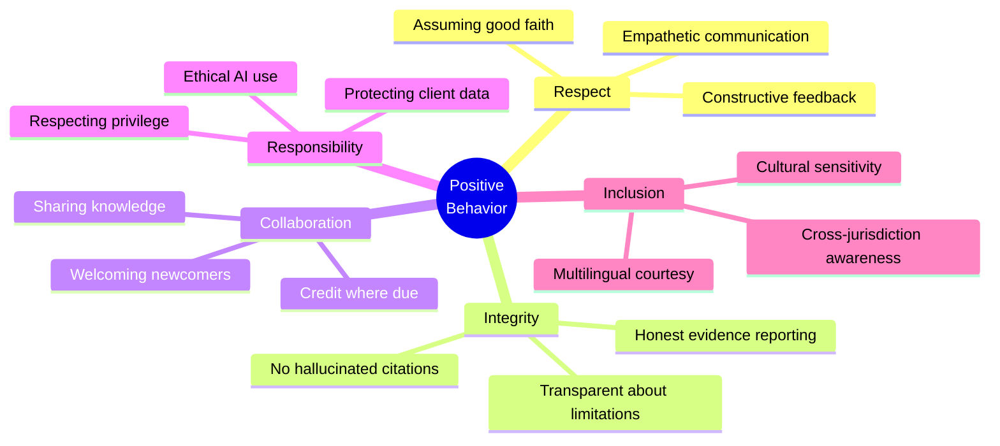
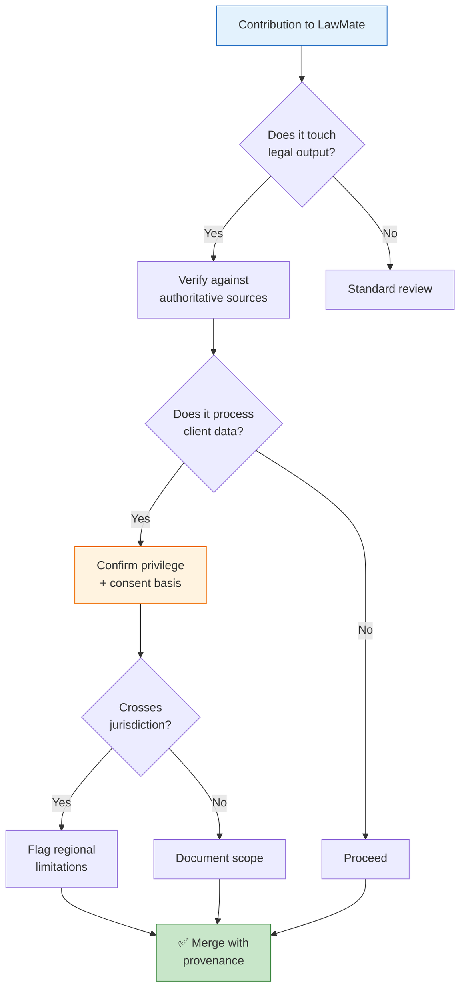
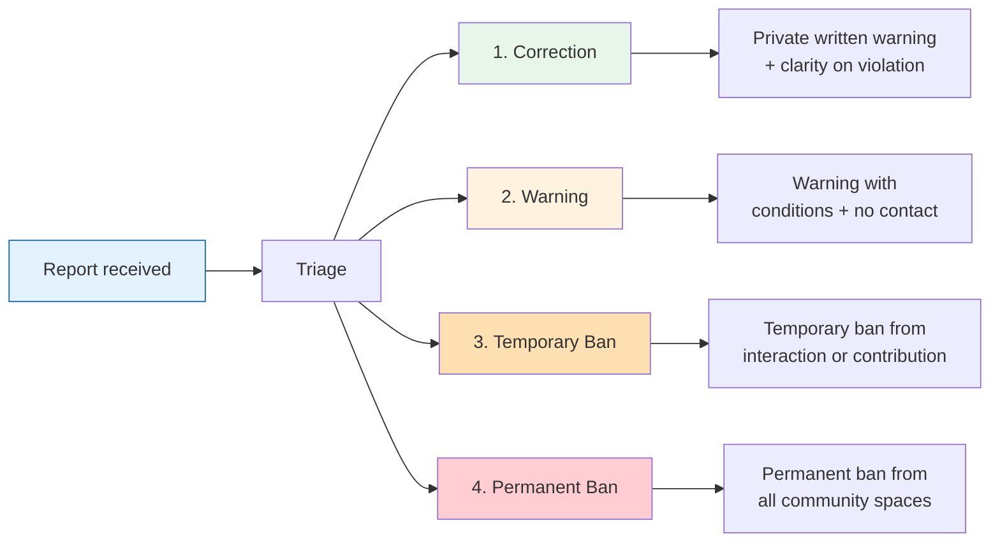
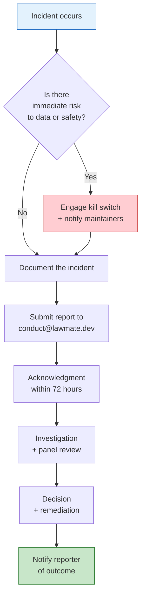

# Code of Conduct

## Our Pledge

We as members, contributors, and leaders of **LawMate** pledge to make participation in our community a harassment-free experience for everyone, regardless of age, body size, visible or invisible disability, ethnicity, sex characteristics, gender identity and expression, level of experience, education, socio-economic status, nationality, personal appearance, race, caste, color, religion, or sexual identity and orientation.

We pledge to act and interact in ways that contribute to an open, welcoming, diverse, inclusive, and healthy community.

Given that LawMate operates in the **legal technology domain**, we additionally recognize a heightened responsibility: our work touches matters of justice, privilege, confidentiality, and client trust. We therefore commit to upholding not only interpersonal respect but also **professional integrity, evidentiary honesty, and the responsible stewardship of legal data**.

---

## Our Standards

### ✅ Examples of behavior that contributes to a positive environment

- Demonstrating empathy and kindness toward other people
- Being respectful of differing opinions, viewpoints, and experiences
- Giving and gracefully accepting constructive feedback
- Accepting responsibility and apologizing to those affected by our mistakes, and learning from the experience
- Focusing on what is best not just for us as individuals, but for the overall community
- **Reporting model behavior honestly** — never fabricating evaluation results, benchmark scores, or retrieval accuracy
- **Flagging hallucinations** — promptly disclosing when the system produces inaccurate, unsupported, or fabricated legal content
- **Respecting confidentiality** — treating client data, privileged communications, and matter files with the care the legal profession demands
- **Acknowledging jurisdiction limits** — being transparent that outputs may not apply across all legal systems and regions
- **Citing sources faithfully** — ensuring provenance chains and audit logs reflect genuine evidence, not convenient reconstruction
- **Protecting human oversight** — respecting HITL gates, approval queues, and kill switches rather than circumventing them

### ❌ Examples of unacceptable behavior

- The use of sexualized language or imagery, and sexual attention or advances of any kind
- Trolling, insulting or derogatory comments, and personal or political attacks
- Public or private harassment
- Publishing others' private information, such as a physical or email address, without their explicit permission
- Other conduct which could reasonably be considered inappropriate in a professional setting
- **Deliberately injecting adversarial prompts** into shared environments to degrade system behavior for others
- **Misrepresenting AI output as verified legal advice** without appropriate disclaimers or human review
- **Bypassing safety, audit, or approval controls** — including the kill switch, HMAC signing, or provenance chain — whether for convenience, testing, or demonstration
- **Exfiltrating datasets, embeddings, or client matters** to unauthorized providers or personal environments
- **Committing secrets, keys, or privileged documents** to the repository, issues, or pull requests
- **Weaponizing governance tooling** against contributors — using audit logs, evidence chains, or approval queues to intimidate, retaliate, or surveil colleagues

---

## Legal & Ethical Responsibilities

Because LawMate is designed to support legal work, contributors bear additional responsibilities that go beyond typical open-source norms.

1. **No unauthorized practice of law.** Contributions must not present the system as a substitute for licensed legal counsel. Disclaimers and HITL gates exist for this reason and must not be removed.
2. **Confidentiality first.** Never use real client matters, privileged communications, or identifying case details in tests, examples, issues, or demos. Use the synthetic datasets under `datasets/` instead.
3. **Provenance is sacred.** Audit logs, evidence chains, and HMAC-signed records exist to preserve accountability. Do not alter, backfill, or fabricate them.
4. **Jurisdiction honesty.** The platform's grounding includes ASEAN, Malaysian, and other regional data. Do not overstate coverage; document where the system is and is not reliable.
5. **Safety mechanisms are non-negotiable.** The `safety/`, `hitl/`, and `hardening/` subsystems are load-bearing. Proposals to weaken them require explicit, documented justification and maintainer approval.

---

## Enforcement Responsibilities

Community leaders are responsible for clarifying and enforcing our standards of acceptable behavior and will take appropriate and fair corrective action in response to any behavior that they deem inappropriate, threatening, offensive, or harmful.

Community leaders have the right and responsibility to remove, edit, or reject comments, commits, code, wiki edits, issues, and other contributions that are not aligned to this Code of Conduct, and will communicate reasons for moderation decisions when appropriate.

For legal-technology-specific concerns — such as suspected hallucination in a merged feature, mishandling of client data, or bypassing of audit controls — maintainers may escalate to a **Designated Review Panel** consisting of at least one maintainer and one contributor with legal-domain familiarity.

---

## Scope

This Code of Conduct applies within all community spaces, and also applies when an individual is officially representing the community in public spaces. Examples of representing our community include using an official email address, posting via an official social media account, or acting as an appointed representative at an online or offline event.

It additionally applies to:

- Contributions to `app/`, `backend/`, `workers/`, `prisma/`, `lib/`, and `.autoclaw/`
- Prompt engineering, skill authoring, and dataset curation under `datasets/` and `.openclaw/skills/`
- Evaluation submissions (`test:gold`, gold eval datasets, adversarial vectors)
- Governance and audit interactions — including `safety/`, `evidence/`, `hitl/`, and `fabric/` subsystems
- Communication in issues, pull requests, discussions, and any channel associated with the project

---

## Enforcement

Instances of abusive, harassing, or otherwise unacceptable behavior may be reported to the community leaders responsible for enforcement at:

> **conduct@lawmate.dev** *(placeholder — replace with your maintained contact)*

All complaints will be reviewed and investigated promptly and fairly. All community leaders are obligated to respect the privacy and security of the reporter of any incident.

### Enforcement Guidelines

Community leaders will follow these Community Impact Guidelines in determining the consequences for any action they deem in violation of this Code of Conduct:

#### 1. Correction

**Community Impact:** Use of inappropriate language or other behavior deemed unprofessional or unwelcome in the community.

**Consequence:** A private, written warning from community leaders, providing clarity around the nature of the violation and an explanation of why the behavior was inappropriate. A public apology may be requested.

#### 2. Warning

**Community Impact:** A violation through a single incident or series of actions.

**Consequence:** A warning with consequences for continued behavior. No interaction with the people involved, including unsolicited interaction with those enforcing the Code of Conduct, for a specified period of time. This includes avoiding interactions in community spaces as well as external channels like social media. Violating these terms may lead to a temporary or permanent ban.

#### 3. Temporary Ban

**Community Impact:** A serious violation of community standards, including sustained inappropriate behavior.

**Consequence:** A temporary ban from any sort of interaction or public communication with the community for a specified period of time. No public or private interaction with the people involved, including unsolicited interaction with those enforcing the Code of Conduct, is allowed during this period. Violating these terms may lead to a permanent ban.

#### 4. Permanent Ban

**Community Impact:** Demonstrating a pattern of violation of community standards, including sustained inappropriate behavior, harassment of an individual, or aggression toward or disparagement of classes of individuals.

**Consequence:** A permanent ban from any sort of public interaction within the community.

#### 5. Legal-Technology Escalation *(project-specific)*

For violations involving client data mishandling, deliberate hallucination in merged code, or circumvention of safety/audit controls, maintainers may additionally:

- Revoke commit access immediately, pending review
- Revert affected contributions and notify downstream consumers
- Preserve relevant evidence chains under `.autoclaw/evidence/` for audit
- Report to relevant professional bodies if the conduct implicates licensed practitioners

---

## Reporting Guidelines

When reporting, please include:

- **What happened** — a factual description of the incident
- **Where and when** — repository, issue, PR, channel, or event
- **Who was involved** — handles or identities, if known
- **Evidence** — links, screenshots, log excerpts (avoid including privileged or client data)
- **Impact** — who was affected and how
- **Preferred outcome** — if you have one

If the report involves a maintainer, please report directly to a second maintainer or the Designated Review Panel to avoid conflicts of interest.

---

## Attribution

This Code of Conduct is adapted from the [Contributor Covenant](https://www.contributor-covenant.org), version 2.1, available at [https://www.contributor-covenant.org/version/2/1/code_of_conduct.html](https://www.contributor-covenant.org/version/2/1/code_of_conduct.html).

Community Impact Guidelines were inspired by [Mozilla's code of conduct enforcement ladder](https://github.com/mozilla/diversity).

The legal-technology-specific provisions — including confidentiality, provenance integrity, jurisdiction honesty, and safety-control protections — were authored for LawMate and reflect the platform's obligations to the legal profession and the clients it ultimately serves.

For answers to common questions about this code of conduct, see the FAQ at [https://www.contributor-covenant.org/faq](https://www.contributor-covenant.org/faq). Translations are available at [https://www.contributor-covenant.org/translations](https://www.contributor-covenant.org/translations).

---

## Versioning

This Code of Conduct is versioned alongside the repository. Material changes will be announced in the project's release notes and, where appropriate, discussed in a public issue before adoption.

| Version | Date | Notes |
|---|---|---|
| 1.0 | Initial | Adapted from Contributor Covenant 2.1 with LawMate-specific legal-technology provisions |